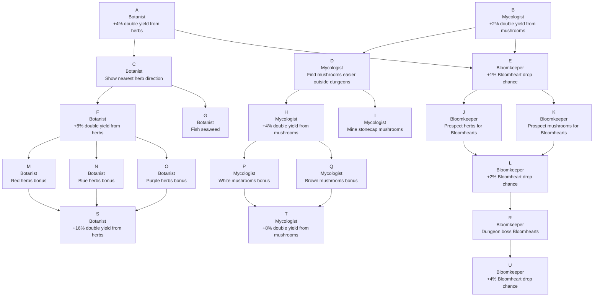

# Herbalism Skill Design

## Role

Herbalism is a resource gathering skill. It lets players recognize and harvest plants, fungi, and other natural reagents spread across the world. The skill does not craft finished items by itself; most Herbalism value flows into Alchemy, trading, and dungeon preparation.

Higher Herbalism should make more of the world useful rather than simply replacing older herbs. A high-level player may still gather early herbs such as Moonleaf when passing through safe areas because those reagents remain useful in recipes.

## Level 1-30 Reagent Unlocks

| Level | Reagent | Node Type | Where It Appears | Base Yield | XP | Alchemy Role |
|---:|---|---|---|---:|---:|---|
| 1 | Moonleaf | Herb | safe meadows near settlement | 1 | 8 | basic healing, weak restoration elixirs |
| 5 | Sunspindle | Herb | roadsides, sunny fields, farm edges | 1 | 11 | stamina, movement, light resistance |
| 10 | Briarcap | Herb | forest edges, thorny groves, denser wild areas | 1 | 15 | antidotes, bleed/poison mitigation |
| 18 | Gloomcap | Mushroom | caves, dungeon side rooms, damp ruins | 1 | 22 | darkness vision, fear/magic resistance |
| 20 | Emberroot | Herb | warm rocky slopes, dangerous meadow edges | 1 | 26 | fire resistance, burst damage elixirs |
| 25 | Silverthorn | Herb | rare overworld nodes in risky outer zones | 1 | 32 | stronger healing, protection, Bloomheart synergy |
| 28 | Gravebloom Fungus | Mushroom | deeper caves, dungeon boss-adjacent rooms | 1 | 38 | death/curse resistance, revive/last-stand elixirs |

## Reagent Specs

| Item ID | Display Name | Level | Node Family | Spawn Environments | Rarity | Base Yield | XP | Stack Size | Respawn Class | Alchemy Tags | Later Use |
|---|---|---:|---|---|---|---:|---:|---:|---|---|---|
| moonleaf | Moonleaf | 1 | Herb | safe meadow, settlement outskirts | common | 1 | 8 | 20 | common herb | healing, restoration | yes; baseline reagent for simple and later bulk healing recipes |
| sunspindle | Sunspindle | 5 | Herb | roadside, sunny field, farm edge | common | 1 | 11 | 20 | common herb | stamina, movement, light | yes; mobility and light-resistance recipes stay useful in travel and dungeons |
| briarcap | Briarcap | 10 | Herb | forest edge, thorn grove, dense wilds | common | 1 | 15 | 20 | common herb | antidote, bleed, poison | yes; common counterplay reagent for poison or bleed hazards |
| gloomcap | Gloomcap | 18 | Mushroom | cave, dungeon side room, damp ruin | uncommon | 1 | 22 | 20 | cave mushroom | darkness, fear, magic-resist | yes; dungeon preparation reagent for dark or magic-heavy areas |
| emberroot | Emberroot | 20 | Herb | warm rocks, dangerous meadow edge, scorched soil | uncommon | 1 | 26 | 20 | risk herb | fire, burst, heat | situational; used when fire damage or burst output matters |
| silverthorn | Silverthorn | 25 | Herb | risky outer zone, old grove, guarded clearing | rare | 1 | 32 | 20 | rare overworld herb | protection, healing, Bloomheart | yes; premium reagent for stronger protective and healing recipes |
| gravebloom_fungus | Gravebloom Fungus | 28 | Mushroom | deep cave, dungeon boss-adjacent room, burial ruin | rare | 1 | 38 | 20 | deep mushroom | curse, death, revive, last-stand | situational; high-value dungeon reagent for dangerous boss mechanics |

## Gathering Rules

| Rule | Draft |
|---|---|
| Level gate | Player cannot gather nodes above their Herbalism level. |
| Node visibility | Above-level nodes are visible but show "Requires Herbalism X." |
| Yield | Every successful gather gives 1 reagent. |
| Higher skill bonus | No higher-skill yield bonus for the first Herbalism slice. |
| Shared nodes | Nodes are shared world spawns, not per-player. |
| Respawn | Common herbs: 45-90s. Risk herbs: 2-4 min. Mushrooms: per dungeon run or longer cave respawns. |
| Main purpose | Herbalism only gathers reagents. Alchemy turns those reagents into usable value. |

## Item Families

| Family | Source | Rarity | Specialization |
|---|---|---|---|
| Herbs | Found across the overworld. | Fairly common. | Botanist |
| Mushrooms | Found in caves, dungeons, and other underground or damp areas. | More uncommon. | Mycologist |
| Bloomhearts | Rare living reagent cores found through gathering, prospecting, boss drops, and other special sources. | Very rare. | Bloomkeeper |

## Specialization Paths

Herbalism has three specialization paths. Botanist focuses on overworld herbs, Mycologist focuses on mushrooms and cave resources, and Bloomkeeper focuses on rare Bloomheart discovery.

| Path | Focus | Perks |
|---|---|---|
| Botanist | Herbs, overworld routes, herb yield, herb color specialization. | A, C, F, G, M, N, O, S |
| Mycologist | Mushrooms, cave/dungeon fungi, unusual gathering sources. | B, D, H, I, P, Q, T |
| Bloomkeeper | Bloomheart discovery, prospecting, rare drops, dungeon boss rewards. | E, J, K, L, R, U |

## Specialization Perk Tree

| ID | Path | Perk Name | Perk Effect | Requires |
|---|---|---|---|---|
| A | Botanist | Herb Collector | Gain 4% chance to get double yield from herbs. | None |
| B | Mycologist | Mushroom Collector | Gain 2% chance to get double yield from mushrooms. | None |
| C | Botanist | Leafsense | Briefly show the direction of the nearest herb node after picking a herb. | A |
| D | Mycologist | Fungal Eye | Find mushrooms easier outside of dungeons. | B |
| E | Bloomkeeper | Bloomheart Instinct | Increase the random drop chance of a Bloomheart by 1%. | A or B |
| F | Botanist | Herb Harvester | Gain 8% chance to get double yield from herbs. | C |
| G | Botanist | Tide Greens | Gain the ability to fish seaweed. | C |
| H | Mycologist | Mushroom Harvester | Gain 4% chance to get double yield from mushrooms. | D |
| I | Mycologist | Stonecap Lore | Gain the ability to mine stonecap mushrooms. | D |
| J | Bloomkeeper | Herbal Prospecting | Prospect and consume herbs for a 5% chance to find a Bloomheart. | E |
| K | Bloomkeeper | Fungal Prospecting | Prospect and consume mushrooms for a 10% chance to find a Bloomheart. | E |
| L | Bloomkeeper | Living Core | Increase the random drop chance of a Bloomheart by 2%. | J or K |
| M | Botanist | Crimson Harvest | Increase the chance of double yield and XP from red herbs by an additional 10%. | F |
| N | Botanist | Azure Harvest | Increase the chance of double yield and XP from blue herbs by an additional 10%. | F |
| O | Botanist | Violet Harvest | Increase the chance of double yield and XP from purple herbs by an additional 10%. | F |
| P | Mycologist | Pale Mycelia | Increase the chance of double yield and XP from white mushrooms by an additional 5%. | H |
| Q | Mycologist | Earthen Mycelia | Increase the chance of double yield and XP from brown mushrooms by an additional 5%. | H |
| R | Bloomkeeper | Heart of the Hoard | Dungeon bosses have a chance to drop a Bloomheart. | L |
| S | Botanist | Expert Herb Harvester | Gain 16% chance to get double yield from herbs. | M or N or O |
| T | Mycologist | Expert Mushroom Harvester | Gain 8% chance to get double yield from mushrooms. | P or Q |
| U | Bloomkeeper | Bloomkeeper's Gift | Increase the random drop chance of a Bloomheart by 4%. | R |

## First Vertical Slice

The first implemented slice should include Moonleaf, Sunspindle, Briarcap, and Gloomcap. This covers safe gathering, biome variety, level-gated gathering, and the first cave or dungeon-only reagent.
